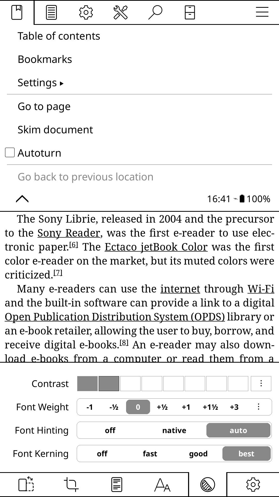

# Design Research: Ebook Reader UI — Layout, Tipografía y Controles

> Investigación para SharkReader-main · 2026-05-09

---

## TL;DR

Los mejores readers (Kindle, Kobo, KOReader, Apple Books) comparten tres principios
irrompibles: **controles emergentes** (se ocultan solos), **tipografía como feature
de primer orden** (no un afterthought), y **ancho de columna estrecho por defecto**
(60-70 ch máximo). SharkReader ya tiene buenas bases — lo que falta es pulir la
jerarquía visual del panel de fuentes, afinar el comportamiento del toolbar en modo
scroll, y reducir el ancho de columna predeterminado.

---

## Recommendations / Next Steps

### 1. Panel de tipografía — reorganizar como drawer de 2 columnas

**El problema actual:** el menú Aa de SharkReader apila todo en vertical dentro de
un popover. Kindle usa un sistema de tabs; Apple Books agrupa por categoria con
separadores claros. KOReader muestra los sliders de tipografía en una barra
persistente en la parte inferior de la pantalla.

**Qué implementar:**

```
┌────────────────────────────────────────────┐
│  Aa  ·  Tipografía                    [×]  │
├────────────────────────────────────────────┤
│  FUENTE                                    │
│  [Inter] [Georgia] [Merriweather] [Lora]   │
│  [Crimson] [Slab]  [OpenDyslexic]          │
├────────────────────────────────────────────┤
│  TAMAÑO          [−] ─────●─── [+]  110%  │
│  INTERLINEADO    [−] ─────●─── [+]  1.6×  │
├────────────────────────────────────────────┤
│  TEXTO                                     │
│  [✓ Justificado] [  Sangría] [  Sílabas]  │
│  Interletraje   A·A ─────●──────   +0‰   │
├────────────────────────────────────────────┤
│  COLUMNA         [Estrecha] [Normal] [Ancha]│
├────────────────────────────────────────────┤
│  TEMA DE COLOR                             │
│  [⬜ Claro] [🟤 Sepia] [⬛ Oscuro] [▒ Carbón]│
└────────────────────────────────────────────┘
```

**Por qué:** la separación por categorías (FUENTE / TEXTO / COLUMNA / COLOR) hace
que cada sección sea encontrable sin leer toda la lista. Kobo lo llama "Reading
Settings" y tiene 4 secciones. Kindle usa tabs (Font | Layout | Color).

---

### 2. Ancho de columna — 640px por defecto en scroll, 760px en paginado

**El problema actual:** 1000px era demasiado. 640-760px está en el sweet spot
validado por Kindle Paperwhite (~480px efectivos en e-ink) y la recomendación
tipográfica de 60-75 caracteres por línea.

**Regla de los tres anchos:**
```
Estrecha  640px  →  para scroll/continuo, mobile, pantallas pequeñas
Normal    760px  →  para paginado simple, laptops, predeterminado desktop
Ancha     960px  →  para paginado doble spread o pantallas 4K
```

Kindle aplica máximo ~480px de texto con márgenes amplios. Apple Books en iPad
usa ~560px con márgenes generosos. SharkReader en modo estrecho (640px) ya
incluye los px de padding del viewer, dejando ~560px de texto — perfecto.

---

### 3. Toolbar — comportamiento diferente en paginado vs scroll

**Kindle pattern (paginado):** toca en el centro → toolbar aparece 3 segundos
→ se oculta solo. No hay barra fija visible durante la lectura.

**KOReader pattern (scroll):** barra mínima persistente en la parte inferior
con sólo % de progreso y nombre de capítulo. Los controles están a un swipe de
distancia, no visibles todo el tiempo.

**Lo que SharkReader debería hacer:**

```
Modo paginado:
┌────────────────────────────────────┐
│  ← Título del libro        [Aa][☀]│  ← aparece al tocar, se oculta a los 3s
└────────────────────────────────────┘
[area del libro sin UI visible]
└──── 42% ──── Cap. 3: El regreso ──┘  ← solo progress bar, minimal

Modo scroll:
┌────────────────────────────────────┐
│  [barra completa siempre visible]  │  ← OK en scroll, usuario necesita referencia
└────────────────────────────────────┘
[texto fluyendo continuo]
└──── Capítulo 3 · 42% ─────────────┘
```

---

### 4. Barra de progreso — añadir capítulo actual y tiempo estimado

**Kobo (2025):** muestra "42% · 2h 15m restantes" o "Capítulo 3 de 12".
**Kindle:** muestra "Posición 1234 de 4892" o "42 min. restantes en el capítulo".
**KOReader:** muestra el capítulo actual en el header y el % en el footer.

**SharkReader actual:** muestra nombre del libro + % — bien, pero falta el
capítulo actual que ya está disponible en `currentChapterTitle`.

```
┌──────────────────────────────────────────────────────┐
│ ████████████░░░░░░░░░░░░░░░░░░░  (barra de progreso) │
│ Cap. 3: El regreso                           42%     │
└──────────────────────────────────────────────────────┘
```

Reemplazar el nombre del libro (ya visible en el header) por el capítulo actual.

---

### 5. Modo Zen — añadir un gesto de retorno más obvio

**KOReader Zen UI:** swipe hacia abajo desde cualquier punto de la pantalla
muestra un mini-menú flotante centrado con los controles más usados. No hay
barra, solo un overlay circular que aparece y desaparece.

**Readest / ZenReader:** en modo inmersivo, un único punto `···` en el centro
superior se hace visible al acercarse el cursor. Al hacer click emerge el panel.

**SharkReader actual:** ya implementado el botón `···` en hover. Mejorar:
- Aumentar el área de hover (usar un div invisible de 48px de alto)
- Añadir un fade-in de 0.15s con ligero translateY(-4px)
- El texto `···` debería ser más visible (opacity: 0.35 en reposo, no 0)

```
                    [· · ·]   ← visible a opacity 0.35 siempre
                              ← al hover: opacity 1, escala 1.05
```

---

### 6. TOC panel — entrada con slide desde la izquierda

**Todos los readers de referencia** animan el TOC entrando desde la izquierda
(Kindle, Apple Books, Kobo). El panel tiene un backdrop semitransparente.

**SharkReader actual:** el panel aparece sin animación (tiene `fade-in` en CSS
pero el panel lateral del TOC no la usa de forma controlada).

```
Estado cerrado:          Estado abierto:
┌──────────────────┐    ┌────────┬─────────────┐
│                  │    │ TOC    │             │
│   [libro]        │ →  │ Cap 1  │   [libro]   │
│                  │    │ Cap 2  │             │
└──────────────────┘    └────────┴─────────────┘
                         ←240px→
```

Añadir `transition: transform 0.25s cubic-bezier(0.16,1,0.3,1)` al panel del TOC,
con `transform: translateX(-100%)` como estado inicial.

---

### 7. Tema Carbón (Charcoal) — Kobo 2025

Kobo añadió en 2025 un modo "Charcoal" que es distinto del dark total:
- Fondo: `#2b2b2b` (no negro puro `#000`)
- Texto: `#d4d4d4` (no blanco puro `#fff`)
- Ratio contraste: ~7:1 — más que suficiente, menos agresivo que dark total

**Anti-pattern a evitar:** blanco puro sobre negro puro crea "halation" (efecto
halo visual alrededor del texto). Los mejores readers usan always off-white sobre
dark gray.

SharkReader tiene `#0f1117` (casi negro) — podría añadirse `#1e1e1e` como preset
carbón para tener la misma opción que Kobo.

---

## Key Examples

### KOReader — Panel de tipografía en la parte inferior de pantalla



*KOReader muestra el panel de tipografía como una barra persistente en la parte
inferior: Contraste, Font Weight (escala de -1 a +3), Font Hinting (off/native/auto)
y Font Kerning (off/fast/good/best). Los controles son discretos (steps), no sliders
continuos. La barra de iconos de navegación ocupa la parte baja. [Web]*

**Qué nos enseña para SharkReader:**
- Los sliders continuos son menos precisos que los botones de steps (+/−) para
  ajustes de peso/kerning
- El panel de fuentes puede ser una barra inferior en lugar de un popover flotante
- KOReader muestra Font Weight como escala -1 a +3 (Kindle también tiene esto)
  — SharkReader no tiene control de peso de fuente todavía

---

## Patterns

Los 5 patrones que comparten TODOS los readers top:

1. **Tap-to-reveal en paginado, barra mínima en scroll** — ningún reader muestra
   chrome permanente en modo libro paginado. El usuario quiere leer, no ver UI.

2. **4-5 presets de color fijos** (Claro, Sepia, Oscuro, Carbón) en lugar de picker
   RGB — reduce la parálisis de elección. Todos los readers lo hacen así.

3. **Controles de tipografía independientes** — tamaño, interlineado, márgenes,
   espaciado de caracteres, espaciado de palabras son sliders separados. Nunca
   un único "más grande / más pequeño".

4. **Ancho de columna estrecho por defecto** — nadie lee a 1000px. El estándar
   de la industria es 60-75 caracteres (~560-720px dependiendo del tamaño de fuente).

5. **TOC como panel lateral** (no modal), slide-in desde la izquierda, con
   overlay semitransparente detrás.

---

## Anti-Patterns

- **Barra de herramientas siempre visible en modo paginado** — distrae, rompe
  la inmersión. Todos los readers top la ocultan por defecto.

- **scrollBehavior: smooth en el viewer div** — ya removido en SharkReader.
  El scroll nativo del OS es siempre más suave que el CSS smooth.

- **Ancho de columna >800px para texto prosa** — nadie en la industria lo hace.
  Hasta Kindle en tablet limita a ~560px efectivos de texto.

- **White `#fff` sobre black `#000` en modo oscuro** — genera halation. Usar
  off-white `#e8e8e8` sobre dark gray `#1a1a1a` o similar.

- **Panel de fuentes sin categorías** — cuando hay muchos controles, agruparlos
  bajo headers (FUENTE / TEXTO / COLUMNA / COLOR) reduce el tiempo de búsqueda.

- **Progress bar que muestra el nombre del libro** — ya visible en el header,
  es redundante. Mejor usar ese espacio para el capítulo actual.

---

## Unique Angles

**KOReader — Font Kerning como opción explícita:** KOReader expone
`off / fast / good / best` como opciones de kerning. Es el único reader que
hace esto visible. "Best" usa kerning OpenType completo con hinting óptimo —
la diferencia visual en textos serif es notable. SharkReader podría añadir
`font-kerning: normal` y `font-feature-settings: "kern" 1` como toggle.

**Kindle — Paragraph spacing independiente del line spacing:** Kindle separa
el espaciado entre párrafos del interlineado interno. La mayoría de apps los
mezcla. Para libros con párrafos sin sangría, el paragraph spacing extra es
esencial para que el texto "respire".

**Kobo Charcoal (2025) — El modo oscuro amable:** el Charcoal mode de Kobo
es más oscuro que sepia pero menos agresivo que dark. Resuelve el problema
de lectores nocturnos que encuentran dark mode muy contrastado pero sepia
demasiado claro. Un preset `#262626` bg + `#cccccc` text sería el equivalente.

**Apple Books — Justify toggle prominente:** Apple Books tiene el toggle de
"Justify Text" como opción principal visible (no enterrado). SharkReader ya lo
tiene implementado en el panel — considerar moverlo más arriba en la jerarquía.

---

## Findings

**Sobre el panel de tipografía:**
El panel Aa de Kindle es el más completo de la industria (font, size, weight, line
spacing, paragraph spacing, word spacing, character spacing, margins, color) y está
organizado en tabs. Apple Books lo simplifica a una sola pantalla con secciones
colapsables. KOReader usa una barra persistente inferior para los ajustes más usados.

SharkReader está entre Kindle y Apple Books en completitud. Lo que falta:
- Font weight (boldness control) — Kindle y Apple Books lo tienen
- Paragraph spacing separado del line spacing — Kindle lo tiene
- Preset de color "Carbón" — Kobo 2025 lo añadió

**Sobre el modo scroll (scrolled-doc):**
Todos los readers tratan el scroll como modo secundario. Kobo lo mejora en 2025
con "smoother continuous vertical scroll" — sugiere que era problemático antes.
El insight clave: en scroll mode, el TOC y la barra de progreso son más importantes
porque el usuario pierde la noción de posición en el documento.

**Sobre el modo zen:**
El ZenUI de KOReader (plugin) es el mejor ejemplo: swipe-down desde cualquier
punto activa un mini-menú flotante. La implementación actual de SharkReader (Z key
+ botón oculto en hover) es correcta en dirección pero el área interactiva necesita
ser mayor para que sea descubrible.

---

## Sources

- Kobo Winter 2025 Update: https://www.kobo.com/blog/
- Kindle Text Formatting: https://www.amazon.com/gp/help/customer/display.html?nodeId=T5Y94BzSCGwm0vd75W
- Apple Books Guide: https://support.apple.com/guide/books/change-a-books-appearance-ibks8923126d/mac
- Moon+ Reader Guide: https://www.technipages.com/moon-reader-pro-complete-guide/
- KOReader ZenUI Plugin: https://anthonygress.github.io/zen_ui.koplugin/
- Dark Mode Best Practices: https://atmos.style/blog/dark-mode-ui-best-practices
- Typography UX 2025: https://developerux.com/2025/02/12/typography-in-ux-best-practices-guide/
- Pagination vs Infinite Scroll: https://blog.logrocket.com/ux-design/pagination-vs-infinite-scroll-ux/
- Readest Open Reader: https://readest.com/
- Calibre Viewer Docs: https://manual.calibre-ebook.com/viewer.html
